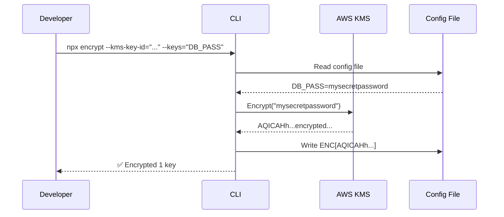
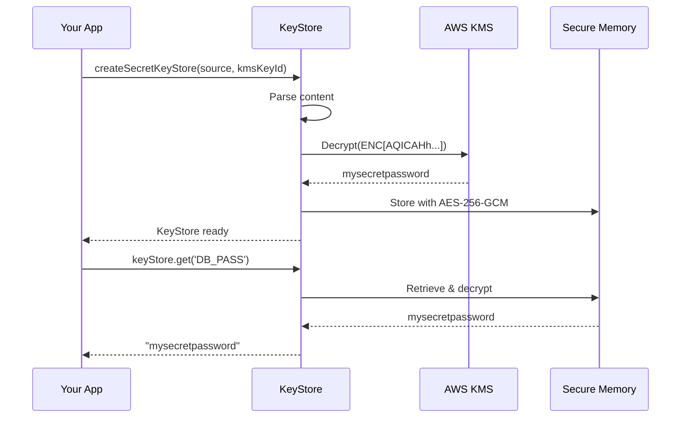
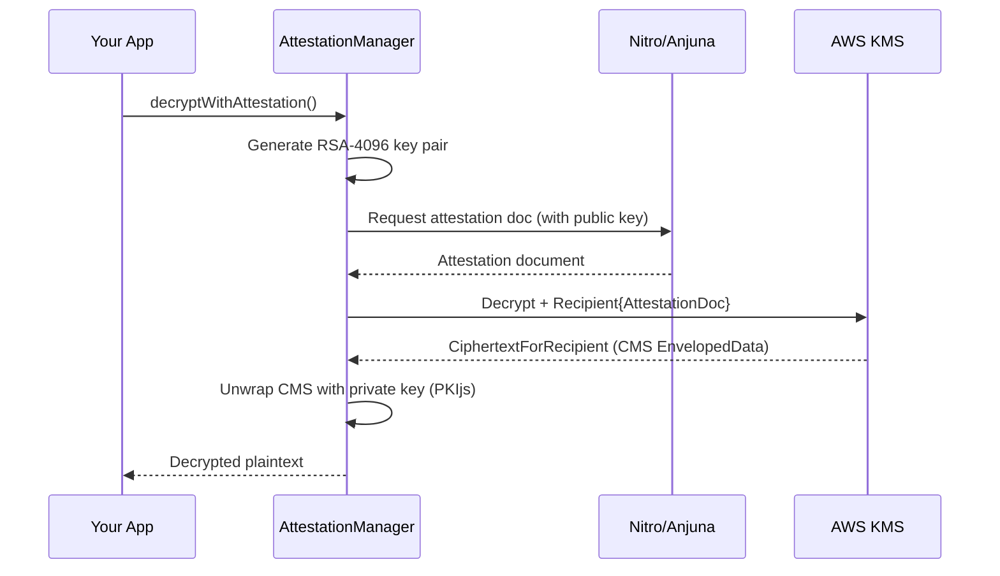

# secret-keystore

A secure secrets management library for Node.js applications using AWS KMS encryption.

**Available on npm:** [`@faizahmedfarooqui/secret-keystore`](https://www.npmjs.com/package/@faizahmedfarooqui/secret-keystore)

## Table of Contents

- [Features](#features)
- [Important Limitations](#important-limitations)
- [Prerequisites](#prerequisites)
- [Installation](#installation)
  - [From npm Registry](#from-npm-registry)
  - [Local Development / Docker Builds](#local-development--docker-builds)
  - [Optional: YAML Support](#optional-yaml-support)
- [Quick Start](#quick-start)
- [CLI Reference](#cli-reference)
- [Library API](#library-api)
- [Runtime Keystore](#runtime-keystore)
- [Configuration Options](#configuration-options)
- [How It Works](#how-it-works)
- [Examples](#examples)
- [Nitro Enclave Attestation](#nitro-enclave-attestation)
- [Error Handling](#error-handling)
- [TypeScript Support](#typescript-support)
- [Troubleshooting](#troubleshooting)
- [Security](#security)

## Features

- **Multi-Format Support** — Encrypt secrets in `.env`, JSON, and YAML files
- **Pattern Matching** — Use glob patterns (`**`) to select keys at any depth
- **AWS KMS Encryption** — Supports symmetric and asymmetric (RSA) keys; uses envelope encryption for RSA (no plaintext size limit)
- **IAM Role by Default** — Uses IAM roles for authentication (explicit credentials require opt-in)
- **Secure In-Memory Storage** — Decrypted values stored with AES-256-GCM encryption in memory
- **Never in `process.env`** — Decrypted secrets are only accessible via the keystore API
- **TTL & Auto-Refresh** — Automatic secret expiry and re-decryption
- **Nitro Enclave Attestation** — Full attestation lifecycle with automatic 5-minute refresh
- **Dual API** — Content-based (convenient) + Object-based (flexible)
- **Comment Preservation** — Preserves comments and formatting in config files
- **Security-First Dependencies** — Minimal dependencies for security-sensitive operations

## Important Limitations

> ⚠️ **This library is for SERVER-SIDE use only.** It will NOT work with client-side code.

### ❌ Does NOT Work With

| Scenario | Reason |
|----------|--------|
| **Next.js `NEXT_PUBLIC_*` variables** | These are embedded into client-side JavaScript at build time and exposed to browsers. Browsers cannot access AWS KMS. |
| **Next.js Client Components** | Client components run in the browser, which has no access to AWS KMS or server-side Node.js APIs. |
| **NestJS with Client-Side Rendering** | Any code that runs in the browser cannot decrypt KMS-encrypted values. |
| **React/Vue/Angular frontend apps** | Frontend JavaScript runs in users' browsers, not on servers with AWS access. |
| **Static Site Generation (SSG) at build time** | Build-time secrets would be embedded in static HTML/JS, defeating the purpose. |

### Why These Don't Work

```
┌─────────────────────────────────────────────────────────────────────────────┐
│                           CLIENT-SIDE (Browser)                              │
│                                                                              │
│   ❌ No AWS credentials                                                      │
│   ❌ No access to AWS KMS API                                                │
│   ❌ No Node.js crypto module                                                │
│   ❌ NEXT_PUBLIC_* variables are bundled into JS at BUILD time               │
│   ❌ Cannot make authenticated AWS API calls                                 │
│                                                                              │
└─────────────────────────────────────────────────────────────────────────────┘

┌─────────────────────────────────────────────────────────────────────────────┐
│                           SERVER-SIDE (Node.js)                              │
│                                                                              │
│   ✅ Has AWS IAM role or credentials                                         │
│   ✅ Can call AWS KMS Decrypt API                                            │
│   ✅ Has Node.js crypto module                                               │
│   ✅ Secrets decrypted at RUNTIME in memory                                  │
│   ✅ Values never sent to browser                                            │
│                                                                              │
└─────────────────────────────────────────────────────────────────────────────┘
```

### ✅ Works With

| Scenario | Example |
|----------|---------|
| **Next.js API Routes** | `src/app/api/*/route.ts` |
| **Next.js Server Components** | Components without `"use client"` |
| **Next.js Server Actions** | Functions with `"use server"` |
| **NestJS Services** | Backend services running on Node.js |
| **Express/Fastify APIs** | Any Node.js backend |
| **AWS Lambda** | Serverless functions |
| **Background Jobs** | Cron jobs, workers, etc. |

### Next.js Example: What Works vs What Doesn't

```typescript
// ❌ WRONG: Client Component - will NOT work
"use client";
import { getSecret } from "@/lib/keystore";

export function ClientComponent() {
  // This will fail - browsers can't access AWS KMS
  const secret = await getSecret("API_KEY"); // ❌ Error!
  return <div>{secret}</div>;
}
```

```typescript
// ❌ WRONG: NEXT_PUBLIC_* variables - CANNOT be encrypted
// These are embedded in client JS at build time
const apiKey = process.env.NEXT_PUBLIC_API_KEY; // Already exposed to browser!
```

```typescript
// ✅ CORRECT: API Route (Server-Side)
// src/app/api/data/route.ts
import { getSecret } from "@/lib/keystore";

export async function GET() {
  // This works - runs on server with AWS access
  const apiKey = await getSecret("API_KEY"); // ✅ Decrypted on server

  const data = await fetchExternalAPI(apiKey);
  return Response.json(data); // Only send non-sensitive data to client
}
```

```typescript
// ✅ CORRECT: Server Component (no "use client")
// src/app/dashboard/page.tsx
import { getSecret } from "@/lib/keystore";

export default async function DashboardPage() {
  // This works - Server Components run on the server
  const dbPassword = await getSecret("DB_PASSWORD"); // ✅ Server-side only

  const data = await fetchFromDatabase(dbPassword);
  return <Dashboard data={data} />; // Render with data, not secrets
}
```

### Summary

| Variable Type | Can Encrypt? | Where It Runs |
|---------------|--------------|---------------|
| Regular env vars (`DB_PASSWORD`) | ✅ Yes | Server only |
| `NEXT_PUBLIC_*` vars | ❌ No | Bundled into client JS |
| Server Component code | ✅ Yes | Server only |
| Client Component code | ❌ No | Browser |
| API Route code | ✅ Yes | Server only |

## Prerequisites

- Node.js >= 18.0.0
- AWS account with KMS access
- AWS IAM role (recommended) or explicit credentials for local development

## Installation

### From npm Registry

The package is published to the public npm registry. Install with:

```bash
npm install @faizahmedfarooqui/secret-keystore
```

> **Note:** The package includes `@aws-sdk/client-kms` as a dependency.

### Local Development / Docker Builds

When working with local development or Docker builds where `file:` references don't work (e.g., the path is outside the Docker build context), you can pack the library into a tarball:

#### Step 1: Pack the Library

```bash
# From the secret-keystore directory
npm pack

# This creates: faizahmedfarooqui-secret-keystore-1.0.0.tgz (scoped package name)
```

Or use the provided npm script:

```bash
# Pack and move to a specific directory (e.g., consumer project)
npm run pack:local
```

#### Step 2: Install the Tarball

In your consumer project:

```bash
# Copy the tarball to your project
cp ../secret-keystore/faizahmedfarooqui-secret-keystore-1.0.0.tgz ./

# Install from tarball
npm install ./faizahmedfarooqui-secret-keystore-1.0.0.tgz
```

Or add a script to your consumer's `package.json`:

```json
{
  "scripts": {
    "pack:keystore": "cd ../secret-keystore && npm pack --pack-destination ../your-project",
    "install:keystore": "npm run pack:keystore && npm install ./faizahmedfarooqui-secret-keystore-*.tgz"
  }
}
```

#### Step 3: Update package.json Reference

After installing, your `package.json` will reference the local tarball:

```json
{
  "dependencies": {
    "@faizahmedfarooqui/secret-keystore": "file:./faizahmedfarooqui-secret-keystore-1.0.0.tgz"
  }
}
```

#### Docker Build Configuration

For Docker builds, copy the tarball into the build context:

```dockerfile
# Stage 1: Install Dependencies
FROM node:22 AS deps
WORKDIR /app

# Copy package files
COPY package.json yarn.lock ./

# Copy the local tarball (must be in the Docker build context)
COPY faizahmedfarooqui-secret-keystore-1.0.0.tgz ./

# Install dependencies (tarball is referenced in package.json)
RUN yarn install --frozen-lockfile
```

> **Important:** The tarball file must be in your project directory (Docker build context). You cannot reference paths outside the build context like `../secret-keystore`.

#### Complete Workflow Example

```bash
# 1. In the keystore library directory
cd secret-keystore
npm pack
mv faizahmedfarooqui-secret-keystore-*.tgz ../your-consumer-project/

# 2. In your consumer project
cd ../your-consumer-project

# Update package.json to reference the tarball
# "dependencies": { "@faizahmedfarooqui/secret-keystore": "file:./faizahmedfarooqui-secret-keystore-1.0.0.tgz" }

npm install

# 3. Commit the tarball to your repo (for CI/CD)
git add faizahmedfarooqui-secret-keystore-*.tgz
git commit -m "Add @faizahmedfarooqui/secret-keystore tarball for Docker builds"
```

### Optional: YAML Support

For YAML files with complex features (anchors, aliases, multi-line strings), install `js-yaml`:

```bash
npm install js-yaml
```

Without `js-yaml`, the library uses a simple built-in parser that handles basic YAML structures. If your YAML uses advanced features without `js-yaml` installed, you'll get a clear error message.

## Quick Start

### Step 1: Prepare Your Configuration

Create a `.env` file with your secrets:

```env
# AWS Configuration (never encrypted)
KMS_KEY_ID=arn:aws:kms:us-east-1:123456789012:key/abcd-1234
AWS_REGION=us-east-1

# Your secrets (will be encrypted)
DB_PASSWORD=mysecretpassword
API_KEY=sk-1234567890abcdef
JWT_SECRET=super-secret-jwt-key

# Non-sensitive values
DB_HOST=localhost
PORT=3000
```

### Step 2: Encrypt Your Secrets

Run the CLI to encrypt secrets:

```bash
# Encrypt specific keys (kms-key-id is REQUIRED)
npx @faizahmedfarooqui/secret-keystore encrypt \
  --kms-key-id="arn:aws:kms:us-east-1:123456789012:key/abcd-1234" \
  --keys="DB_PASSWORD,API_KEY,JWT_SECRET"

# Or encrypt all keys (except reserved ones)
npx @faizahmedfarooqui/secret-keystore encrypt \
  --kms-key-id="alias/my-key"

# For local development, use explicit credentials
npx @faizahmedfarooqui/secret-keystore encrypt \
  --kms-key-id="alias/my-key" \
  --use-credentials
```

Your `.env` file is updated in-place:

```env
# AWS Configuration (never encrypted)
KMS_KEY_ID=arn:aws:kms:us-east-1:123456789012:key/abcd-1234
AWS_REGION=us-east-1

# Encrypted values
DB_PASSWORD=ENC[AQICAHh2nZPq...base64...]
API_KEY=ENC[AQICAHh2nZPq...base64...]
JWT_SECRET=ENC[AQICAHh2nZPq...base64...]
```

### Step 3: Use in Your Application

```javascript
const { createSecretKeyStore } = require('@faizahmedfarooqui/secret-keystore');
const fs = require('node:fs');

async function bootstrap() {
  // Read your config file
  const content = fs.readFileSync('./.env', 'utf-8');
  const kmsKeyId = process.env.KMS_KEY_ID;  // You extract the KMS key

  // Initialize the keystore
  const keyStore = await createSecretKeyStore(
    { type: 'env', content },
    kmsKeyId,  // REQUIRED
    {
      paths: ['DB_PASSWORD', 'API_KEY', 'JWT_SECRET'],
      aws: { region: process.env.AWS_REGION }
    }
  );

  // Access decrypted secrets from the keystore
  const dbPassword = keyStore.get('DB_PASSWORD');  // → "mysecretpassword"
  const apiKey = keyStore.get('API_KEY');          // → "sk-1234567890abcdef"

  // process.env still contains encrypted values (safe!)
  console.log(process.env.DB_PASSWORD);  // → "ENC[AQICAHh...encrypted...]"

  // Start your application
  connectToDatabase({ password: dbPassword });
}

bootstrap();
```

## CLI Reference

```bash
npx @faizahmedfarooqui/secret-keystore encrypt [options]
```

### Options

| Option | Required | Default | Description |
|--------|----------|---------|-------------|
| `--kms-key-id=<id>` | **Yes** | — | KMS Key ID (ARN, UUID, or alias) |
| `--path=<path>` | No | `./.env` | Path to the config file |
| `--format=<format>` | No | auto-detect | File format: `env`, `json`, `yaml` |
| `--keys=<keys>` | No | All keys | Comma-separated list of keys to encrypt |
| `--patterns=<patterns>` | No | — | Glob patterns (e.g., `**.password,**.secret`) |
| `--exclude=<keys>` | No | — | Keys/paths to exclude from encryption |
| `--region=<region>` | No | From env | AWS region |
| `--output=<path>` | No | Overwrite input | Output file path |
| `--use-credentials` | No | — | Use explicit AWS credentials instead of IAM role |
| `--dry-run` | No | — | Preview what would be encrypted |
| `--help, -h` | — | — | Show help message |
| `--version, -v` | — | — | Show version number |

### Authentication

By default, the CLI uses **IAM role** for AWS authentication. This is recommended for production.

To use explicit credentials (e.g., for local development):

```bash
# Set credentials in environment
export AWS_ACCESS_KEY_ID=your-access-key
export AWS_SECRET_ACCESS_KEY=your-secret-key

# Run with --use-credentials flag
npx @faizahmedfarooqui/secret-keystore encrypt \
  --kms-key-id="alias/my-key" \
  --use-credentials
```

### Reserved Keys

These keys are **never encrypted** (required for encryption/decryption process):

- `KMS_KEY_ID`
- `AWS_REGION`
- `AWS_ACCESS_KEY_ID`
- `AWS_SECRET_ACCESS_KEY`
- `AWS_SESSION_TOKEN`

### CLI Examples

```bash
# Encrypt all keys in .env
npx @faizahmedfarooqui/secret-keystore encrypt \
  --kms-key-id="alias/my-key"

# Encrypt specific keys only
npx @faizahmedfarooqui/secret-keystore encrypt \
  --kms-key-id="arn:aws:kms:us-east-1:123456789:key/abc-123" \
  --keys="DB_PASSWORD,API_KEY"

# Encrypt YAML file with patterns
npx @faizahmedfarooqui/secret-keystore encrypt \
  --path="./secrets.yaml" \
  --kms-key-id="alias/my-key" \
  --patterns="**.password,**.secret_key"

# Dry run to preview changes
npx @faizahmedfarooqui/secret-keystore encrypt \
  --kms-key-id="alias/my-key" \
  --dry-run

# Output to a different file
npx @faizahmedfarooqui/secret-keystore encrypt \
  --path="./.env" \
  --output="./.env.encrypted" \
  --kms-key-id="alias/my-key"
```

## Library API

### Single Value Operations

```javascript
const { encryptKMSValue, decryptKMSValue } = require('@faizahmedfarooqui/secret-keystore');

// Encrypt a single value
const ciphertext = await encryptKMSValue(
  'my-secret-password',
  'arn:aws:kms:us-east-1:123456789:key/abc-123',  // kmsKeyId (REQUIRED)
  { aws: { region: 'us-east-1' } }
);
// Returns: "ENC[AQICAHh...]"

// Decrypt a single value
const plaintext = await decryptKMSValue(
  'ENC[AQICAHh...]',
  'arn:aws:kms:us-east-1:123456789:key/abc-123',
  { aws: { region: 'us-east-1' } }
);
// Returns: "my-secret-password"
```

### Multiple Values Operations

```javascript
const { encryptKMSValues, decryptKMSValues } = require('@faizahmedfarooqui/secret-keystore');

// Encrypt multiple values
const result = await encryptKMSValues(
  { DB_PASSWORD: 'secret123', API_KEY: 'sk-12345' },
  'alias/my-key',
  { aws: { region: 'us-east-1' } }
);
// result.values = { DB_PASSWORD: 'ENC[...]', API_KEY: 'ENC[...]' }
// result.encrypted = ['DB_PASSWORD', 'API_KEY']
```

### Content-Based Operations

For working with file content (preserves comments and formatting):

```javascript
const {
  encryptKMSEnvContent,
  encryptKMSJsonContent,
  encryptKMSYamlContent,
  decryptKMSEnvContent,
  decryptKMSJsonContent,
  decryptKMSYamlContent
} = require('@faizahmedfarooqui/secret-keystore');
const fs = require('node:fs');

// Encrypt ENV content
const envContent = fs.readFileSync('./.env', 'utf-8');
const kmsKeyId = process.env.KMS_KEY_ID;

const result = await encryptKMSEnvContent(envContent, kmsKeyId, {
  paths: ['DB_PASSWORD', 'API_KEY'],
  aws: { region: 'us-east-1' }
});

fs.writeFileSync('./.env', result.content);

// Encrypt YAML content with patterns
const yamlContent = fs.readFileSync('./secrets.yaml', 'utf-8');
const yamlResult = await encryptKMSYamlContent(yamlContent, kmsKeyId, {
  patterns: ['**.password', '**.secret_key'],
  preserve: { comments: true, formatting: true }
});
```

### Object-Based Operations

For advanced use cases where you handle parsing/serialization:

```javascript
const { encryptKMSObject, decryptKMSObject } = require('@faizahmedfarooqui/secret-keystore');
const yaml = require('js-yaml');
const fs = require('node:fs');

// Parse YAML yourself
const config = yaml.load(fs.readFileSync('./secrets.yaml', 'utf-8'));
const kmsKeyId = config.kms.key_id;

// Encrypt object
const result = await encryptKMSObject(config, kmsKeyId, {
  patterns: ['**.password', '**.secret_key'],
  exclude: { paths: ['kms.key_id'] }
});

// Serialize and write yourself
fs.writeFileSync('./secrets.yaml', yaml.dump(result.object));
```

### Function Summary

| Function | Purpose |
|----------|---------|
| `encryptKMSValue(plaintext, kmsKeyId, options?)` | Encrypt single value using KMS |
| `decryptKMSValue(ciphertext, kmsKeyId, options?)` | Decrypt single value using KMS |
| `encryptKMSValues(values, kmsKeyId, options?)` | Encrypt flat key-value pairs using KMS |
| `decryptKMSValues(values, kmsKeyId, options?)` | Decrypt flat key-value pairs using KMS |
| `encryptKMSObject(obj, kmsKeyId, options?)` | Encrypt nested object using KMS |
| `decryptKMSObject(obj, kmsKeyId, options?)` | Decrypt nested object using KMS |
| `encryptKMSEnvContent(content, kmsKeyId, options?)` | Encrypt ENV string using KMS |
| `decryptKMSEnvContent(content, kmsKeyId, options?)` | Decrypt ENV string using KMS |
| `encryptKMSJsonContent(content, kmsKeyId, options?)` | Encrypt JSON string using KMS |
| `decryptKMSJsonContent(content, kmsKeyId, options?)` | Decrypt JSON string using KMS |
| `encryptKMSYamlContent(content, kmsKeyId, options?)` | Encrypt YAML string using KMS |
| `decryptKMSYamlContent(content, kmsKeyId, options?)` | Decrypt YAML string using KMS |
| `isJsYamlAvailable()` | Check if `js-yaml` is installed |
| `parseYaml(content)` | Parse YAML to object (uses js-yaml if available) |
| `serializeYaml(obj)` | Serialize object to YAML string |

> **Note:** `kmsKeyId` is **REQUIRED** in all functions. The library does not search content for it.

## Runtime Keystore

### `createSecretKeyStore(source, kmsKeyId, options?)`

Creates and initializes a secure in-memory keystore with decrypted secrets.

```javascript
const { createSecretKeyStore } = require('@faizahmedfarooqui/secret-keystore');
const fs = require('node:fs');

const content = fs.readFileSync('./.env', 'utf-8');
const kmsKeyId = process.env.KMS_KEY_ID;

const keyStore = await createSecretKeyStore(
  { type: 'env', content },
  kmsKeyId,
  {
    paths: ['DB_PASSWORD', 'API_KEY', 'JWT_SECRET'],
    aws: { region: 'us-east-1' },
    security: { inMemoryEncryption: true },
    access: { ttl: 3600000, autoRefresh: true }
  }
);

// Use secrets
const dbPassword = keyStore.get('DB_PASSWORD');

// Cleanup on shutdown
process.on('SIGTERM', () => keyStore.destroy());
```

### Source Types

```javascript
// ENV file content
{ type: 'env', content: 'KEY=value\nKEY2=value2' }

// JSON content
{ type: 'json', content: '{"key": "value"}' }

// YAML content
{ type: 'yaml', content: 'key: value' }

// Pre-parsed object
{ type: 'object', object: { key: 'value' } }

// Flat key-value pairs
{ type: 'values', values: { KEY: 'value' } }
```

### KeyStore Methods

| Method | Returns | Description |
|--------|---------|-------------|
| `get(key)` | `string \| undefined` | Get a decrypted secret |
| `getSection(path)` | `object \| undefined` | Get a nested section |
| `getAll()` | `Record<string, string>` | Get all decrypted secrets |
| `has(key)` | `boolean` | Check if a key exists |
| `keys()` | `string[]` | Get all available key names |
| `isInitialized()` | `boolean` | Check if keystore is ready |
| `getMetadata()` | `object` | Get keystore metadata |
| `getAccessStats(key)` | `object \| null` | Get access statistics for a key |
| `refresh()` | `Promise<void>` | Re-decrypt all secrets |
| `clear()` | `void` | Clear all secrets from memory |
| `clearKey(key)` | `void` | Clear a specific key |
| `destroy()` | `void` | Destroy keystore and wipe memory |

### TTL and Auto-Refresh

| `ttl` | `autoRefresh` | Behavior |
|-------|---------------|----------|
| `null` | — | Secrets never expire |
| `3600000` | `true` | Auto re-decrypt on next `get()` after expiry |
| `3600000` | `false` | Throw error, user calls `refresh()` manually |

## Configuration Options

### Layered Options Structure

```javascript
{
  // AWS Configuration
  aws: {
    credentials: {
      accessKeyId: string,
      secretAccessKey: string,
      sessionToken?: string
    },
    region: string
  },

  // Attestation (Nitro Enclaves) - Full lifecycle managed internally
  attestation: {
    enabled: boolean,           // Default: false
    required: boolean,          // Default: false
    fallbackToStandard: boolean, // Default: true
    endpoint: string,           // Attestation endpoint URL (e.g., Anjuna)
    timeout: number,            // Request timeout (ms), Default: 10000
    userData: string            // Optional user data for attestation
  },

  // Path Selection
  paths: string[],              // Explicit paths
  patterns: string[],           // Glob patterns (** only)
  exclude: {
    paths: string[],
    patterns: string[]
  },

  // Content Preservation
  preserve: {
    comments: boolean,          // Default: true
    formatting: boolean,        // Default: true
    anchors: boolean            // Default: true (YAML)
  },

  // Keystore-specific
  security: {
    inMemoryEncryption: boolean, // Default: true
    secureWipe: boolean          // Default: true
  },
  access: {
    ttl: number | null,         // Secret expiry (ms)
    autoRefresh: boolean,       // Default: true
    accessLimit: number,        // Max access count
    clearOnAccess: boolean      // Default: false
  },
  validation: {
    noProcessEnvLeak: boolean,  // Default: true
    throwOnMissingKey: boolean  // Default: false
  },

  // Logging
  logger: Logger,
  logLevel: 'debug' | 'info' | 'warn' | 'error' | 'silent'
}
```

## How It Works

### KMS Key Types: Symmetric vs Asymmetric

The library detects the key type via AWS KMS `DescribeKey` and chooses the right encryption method:

| Key type | Encryption method | Plaintext size limit |
|----------|-------------------|----------------------|
| **Symmetric** (default CMK) | Direct KMS Encrypt/Decrypt | 4 KB per value |
| **Asymmetric (RSA)** | Envelope encryption | No limit |

**Envelope encryption (RSA only):** For RSA keys, plaintext is too large for direct RSA encryption (e.g. ~190 bytes for RSA_2048). The library generates a random AES-256 data key (DEK), encrypts your secret with the DEK (AES-256-GCM), and encrypts only the DEK with KMS. The stored value is `ENC[base64(envelope)]` where the envelope contains the KMS-encrypted DEK plus IV, ciphertext, and auth tag. Decryption: KMS decrypts the DEK, then the library decrypts the payload with the DEK. Existing values encrypted with symmetric keys or with direct RSA (small payloads) remain valid; new encrypts with RSA use envelope format automatically.

### Build-Time: Encrypting Secrets



### Runtime: Decrypting Secrets



### Key Points

| Stage | `process.env.DB_PASS` | `keyStore.get('DB_PASS')` |
|-------|----------------------|---------------------------|
| Before encryption | `mysecretpassword` | — |
| After encryption | `ENC[AQICAHh...]` | — |
| At runtime (after init) | `ENC[AQICAHh...]` ✓ | `mysecretpassword` ✓ |

> **Security:** Decrypted values are **never** stored in `process.env`. They exist only in the keystore's secure memory with additional AES-256-GCM encryption.

## Examples

Complete working sample applications are available in the `examples/` directory:

| Framework | Path | Description |
|-----------|------|-------------|
| **NestJS** | [`examples/nestjs/`](./examples/nestjs/) | Full NestJS app with global KeyStoreModule |
| **Next.js** | [`examples/nextjs/`](./examples/nextjs/) | Next.js 14 App Router with Server Components |

### Running Examples Locally

```bash
# 1. Install the main package dependencies
cd secret-keystore
npm install

# 2. Install example dependencies
cd examples/nestjs   # or examples/nextjs
npm install

# 3. Configure environment
cp .env.example .env  # or .env.local for Next.js

# 4. Update KMS_KEY_ID in .env with your actual KMS key

# 5. Encrypt secrets
npm run encrypt:keys

# 6. Run the app
npm run start:dev    # NestJS
npm run dev          # Next.js
```

See each example's README for detailed setup instructions.

## Nitro Enclave Attestation

For maximum security in AWS Nitro Enclaves, the library provides **full attestation lifecycle management**.

### How It Works

When attestation is enabled:

1. **Key Pair Generation** — Library generates ephemeral RSA-4096 key pair
2. **Document Fetch** — Fetches attestation document from Anjuna/Nitro endpoint (includes public key)
3. **Attested Decrypt** — Sends KMS Decrypt with `Recipient` parameter containing attestation document
4. **CMS Unwrap** — KMS returns `CiphertextForRecipient` (CMS EnvelopedData), library unwraps with private key
5. **Auto-Refresh** — If document expires (5-min AWS limit), library automatically regenerates and retries



### Enabling Attestation

```javascript
const { createSecretKeyStore } = require('@faizahmedfarooqui/secret-keystore');

const keyStore = await createSecretKeyStore(
  { type: 'env', content },
  kmsKeyId,
  {
    attestation: {
      enabled: true,
      required: true,  // Fail if attestation unavailable
      endpoint: 'http://localhost:8080/attestation',  // Anjuna/Nitro endpoint
      timeout: 10000,
      userData: 'optional-user-data'
    }
  }
);
```

### Using AttestationManager Directly

For advanced use cases, you can use the `AttestationManager` directly:

```javascript
const { createAttestationManager } = require('@faizahmedfarooqui/secret-keystore');
const { KMSClient } = require('@aws-sdk/client-kms');

// Create and initialize the manager
const attestationManager = await createAttestationManager({
  endpoint: 'http://localhost:8080/attestation',
  timeout: 10000,
  logger: console
});

// Use for KMS decrypt with attestation
const kmsClient = new KMSClient({ region: 'us-east-1' });
const plaintext = await attestationManager.decryptWithAttestation(
  kmsClient,
  ciphertextBlob,
  kmsKeyId,
  { encryptionContext: { ... } }
);

// Check status
console.log(attestationManager.getStatus());
// { initialized: true, hasDocument: true, documentAge: 45000, ... }

// Cleanup
attestationManager.destroy();
```

### 5-Minute Auto-Refresh

AWS KMS requires attestation documents to be less than 5 minutes old. The library handles this automatically:

| Scenario | Library Behavior |
|----------|------------------|
| First request | Initialize (generate key pair, fetch doc) |
| Document < 5 min old | Use cached document |
| Document expired (KMS rejects) | Regenerate key pair, fetch new doc, retry once |
| Anjuna/Nitro unavailable | Throw `ATTESTATION_FETCH_FAILED` error |

> **Note:** Attestation is only available inside AWS Nitro Enclaves. Outside enclaves, enable `fallbackToStandard: true` to use standard KMS decrypt.

## Error Handling

The library provides a comprehensive error hierarchy:

```javascript
const {
  createSecretKeyStore,
  SecretKeyStoreError,    // Base error class
  KmsError,               // AWS KMS errors
  AttestationError,       // Attestation failures
  ContentError,           // Content parsing errors
  PathError,              // Path resolution errors
  EncryptionError,        // Encryption failures
  DecryptionError,        // Decryption failures
  KeystoreError,          // Keystore operation errors
  ValidationError         // Validation failures
} = require('@faizahmedfarooqui/secret-keystore');

try {
  const keyStore = await createSecretKeyStore(source, kmsKeyId, options);
  const secret = keyStore.get('DB_PASSWORD');
} catch (error) {
  if (error instanceof KmsError) {
    console.error('KMS Error:', error.code, error.message);
  } else if (error instanceof KeystoreError) {
    console.error('Keystore Error:', error.code, error.message);
  } else if (error instanceof AttestationError) {
    console.error('Attestation Error:', error.code, error.message);
  }
}
```

### Error Codes

| Category | Codes |
|----------|-------|
| **KMS** | `KMS_KEY_NOT_FOUND`, `KMS_KEY_DISABLED`, `KMS_ACCESS_DENIED`, `KMS_INVALID_CIPHERTEXT`, `KMS_THROTTLED` |
| **Attestation** | `ATTESTATION_INIT_FAILED`, `ATTESTATION_DOCUMENT_EXPIRED`, `ATTESTATION_KEY_PAIR_FAILED`, `ATTESTATION_FETCH_FAILED`, `ATTESTATION_CMS_UNWRAP_FAILED` |
| **Keystore** | `KEYSTORE_NOT_INITIALIZED`, `KEYSTORE_DESTROYED`, `SECRET_NOT_FOUND`, `SECRET_EXPIRED` |

## TypeScript Support

The package includes TypeScript definitions:

```typescript
import * as fs from 'node:fs';
import {
  createSecretKeyStore,
  SecretKeyStore,
  KeystoreSource,
  KeystoreOptions,
  encryptKMSEnvContent,
  encryptKMSYamlContent,
  ContentResult,
  // Attestation exports
  AttestationManager,
  createAttestationManager
} from '@faizahmedfarooqui/secret-keystore';

const source: KeystoreSource = {
  type: 'env',
  content: fs.readFileSync('./.env', 'utf-8')
};

const options: KeystoreOptions = {
  paths: ['DB_PASSWORD', 'API_KEY'],
  security: { inMemoryEncryption: true },
  access: { ttl: 3600000, autoRefresh: true }
};

const keyStore: SecretKeyStore = await createSecretKeyStore(
  source,
  kmsKeyId,
  options
);

const password: string | undefined = keyStore.get('DB_PASSWORD');
```

## Troubleshooting

### "kms-key-id is REQUIRED"

The `--kms-key-id` option is required for all CLI operations. Provide your KMS key:

```bash
npx @faizahmedfarooqui/secret-keystore encrypt --kms-key-id="your-kms-key-id"
```

### "Could not load credentials"

The package uses IAM roles by default. If you're seeing this error:

**In production (EC2/ECS/EKS/Lambda):**
- Ensure your instance/task/pod has an IAM role attached
- Verify the IAM role has `kms:Encrypt` and `kms:Decrypt` permissions

**In local development:**
- Use `--use-credentials` flag with the CLI
- Set `AWS_ACCESS_KEY_ID` and `AWS_SECRET_ACCESS_KEY` environment variables

### "AccessDeniedException"

Your AWS credentials don't have permission to use the KMS key:

```json
{
  "Effect": "Allow",
  "Action": ["kms:Encrypt", "kms:Decrypt", "kms:DescribeKey"],
  "Resource": "arn:aws:kms:REGION:ACCOUNT:key/KEY-ID"
}
```

### Already encrypted values being skipped

This is expected behavior. The library automatically detects and skips values that are already encrypted (prefixed with `ENC[`) to prevent double-encryption.

## Security

This package provides multiple layers of protection:

| Layer | Protection |
|-------|------------|
| **IAM Role Default** | Uses IAM roles by default — no credentials to manage |
| **Encryption at Rest** | Secrets in config files are KMS-encrypted ciphertext |
| **Access Control** | IAM policies + KMS key policies control decryption |
| **Runtime Isolation** | Decrypted values never in `process.env` |
| **Memory Protection** | Additional AES-256-GCM encryption in keystore memory |
| **Full Attestation** | Complete Nitro Enclave attestation lifecycle with auto-refresh |
| **Security-First Dependencies** | Minimal third-party dependencies for security operations |

### Attestation Highlights

- **Fully Managed** — Library handles ephemeral key pairs, document fetching, and CMS unwrapping
- **Auto-Refresh** — Automatically regenerates attestation materials on 5-minute expiry
- **CMS Support** — Unwraps KMS `CiphertextForRecipient` using PKIjs/asn1js
- **Zero Config** — Just enable attestation and point to your Anjuna/Nitro endpoint

📖 **[Read the full Security documentation →](./SECURITY.md)**

## License

MIT — see [LICENSE](LICENSE).
