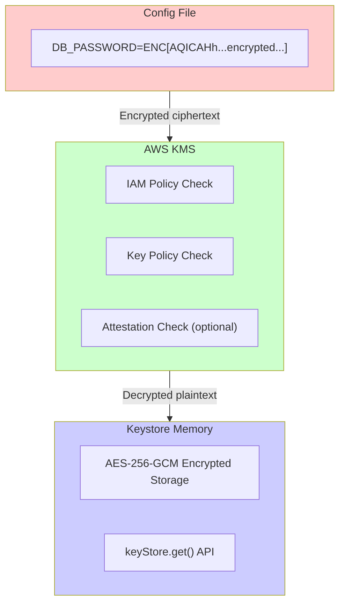
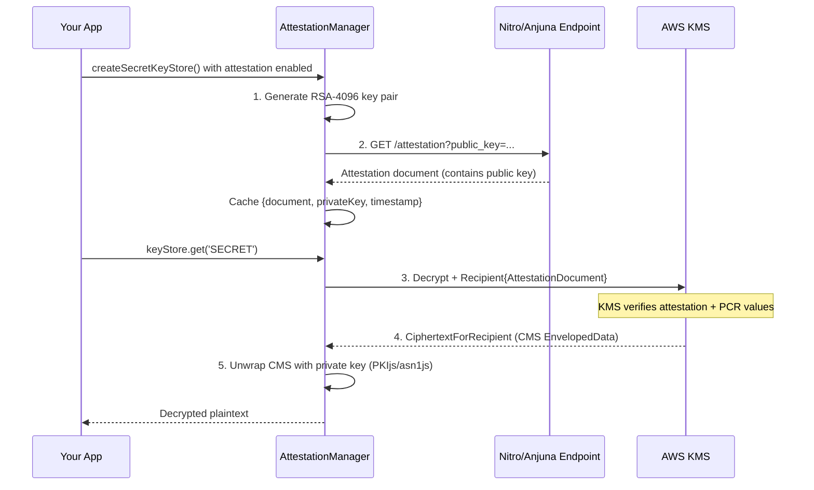
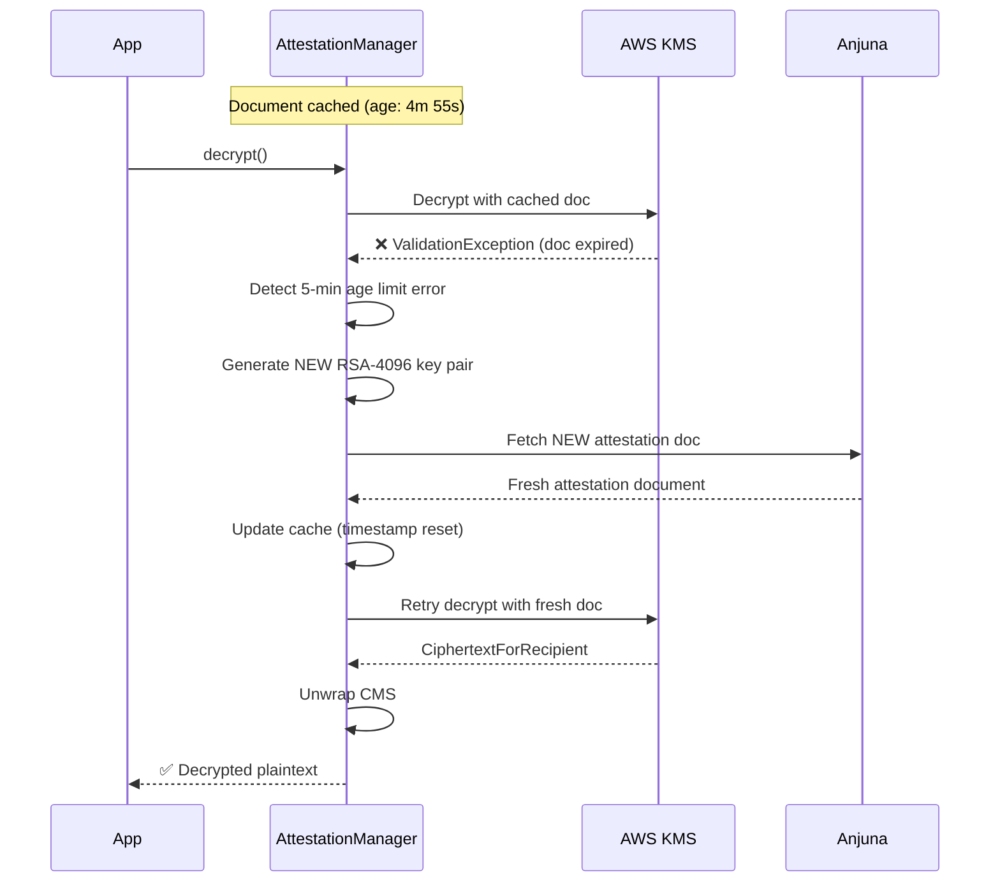

# Security

This document explains the security model of [`@faizahmedfarooqui/secret-keystore`](https://www.npmjs.com/package/@faizahmedfarooqui/secret-keystore) (available on npm) and how it protects your secrets.

> **🔐 Key Design Decision:** This package uses **IAM roles by default**. Explicit AWS credentials require opt-in. This ensures production deployments are secure by default.

## Table of Contents

- [Overview](#overview)
- [Threat Scenarios](#threat-scenarios)
- [Security Layers](#security-layers)
- [Security-First Dependency Policy](#security-first-dependency-policy)
- [Nitro Enclave Attestation](#nitro-enclave-attestation)
  - [Full Attestation Flow](#full-attestation-flow)
  - [5-Minute Auto-Refresh](#5-minute-auto-refresh)
  - [AttestationManager API](#attestationmanager-api)
- [KMS Key Policies](#kms-key-policies)
- [Authentication](#authentication)
- [Best Practices](#best-practices)
- [Security Checklist](#security-checklist)

## Overview

The package provides multiple layers of security:

| Layer | Protection |
|-------|------------|
| **IAM Role Default** | Uses IAM roles by default — no credentials to manage or leak |
| **Encryption at Rest** | Secrets in config files are KMS-encrypted ciphertext (symmetric: direct; RSA: envelope with encrypted DEK) |
| **Access Control** | IAM policies + KMS key policies control decryption |
| **Runtime Isolation** | Decrypted values never in `process.env` |
| **Memory Protection** | Additional AES-256-GCM encryption in keystore memory |
| **Attestation** | Optional Nitro Enclave verification for maximum security |
| **Minimal Dependencies** | Security-sensitive code uses native Node.js modules only |

## Threat Scenarios

### Scenario 1: Attacker gets your config file

If an attacker obtains your `.env` or `secrets.yaml` file, they see:

```env
KMS_KEY_ID=arn:aws:kms:us-east-1:123456789:key/abc-123
DB_PASSWORD=ENC[AQICAHh2nZPq7x9K3mJ...long-base64-ciphertext...]
```

**They CANNOT decrypt `DB_PASSWORD` because:**

| Barrier | Why It Stops Them |
|---------|-------------------|
| **KMS Required** | The ciphertext can ONLY be decrypted by AWS KMS — no offline cracking possible |
| **IAM Required** | They need valid AWS credentials with `kms:Decrypt` permission |
| **Key Policy** | The KMS key policy controls exactly who/what can decrypt |

### Scenario 2: Attacker gets server access

Even with full server access:

| Protection Layer | How It Helps |
|------------------|--------------|
| **IAM Role Binding** | Only the specific EC2/ECS/Lambda role can decrypt |
| **VPC Restrictions** | KMS key policy can restrict to specific VPCs |
| **No Plaintext on Disk** | Decrypted values exist only in memory |
| **No `process.env`** | Can't dump secrets via `/proc/[pid]/environ` |
| **Memory Encryption** | Additional AES-256-GCM encryption in keystore memory |

### Scenario 3: Attacker gets server access + AWS credentials

Even with both:

| Protection | How It Helps |
|------------|--------------|
| **KMS Key Policy** | Can restrict to specific IAM roles only |
| **VPC Conditions** | Can require requests from specific VPCs |
| **Attestation** | Can require valid Nitro Enclave attestation |

## Security Layers



### Layer 1: Encryption at Rest

- Secrets encrypted with AWS KMS before storage
- Only ciphertext exists in config files
- No offline cracking possible — requires KMS API
- Encrypted format: `ENC[...]` (base64). With **symmetric** keys, KMS encrypts the value directly; with **asymmetric (RSA)** keys, the library uses envelope encryption (a random DEK encrypts the secret, KMS encrypts only the DEK; the encrypted DEK is stored with the ciphertext so only KMS can recover it).

### Layer 2: Access Control

- **IAM Policies**: Control which AWS identities can call KMS
- **KMS Key Policies**: Additional layer of access control on the key itself
- **Conditions**: Can restrict by VPC, IP, time, and more

### Layer 3: Runtime Protection

- Decrypted values **never** stored in `process.env`
- Cannot be dumped via `/proc/[pid]/environ`
- Additional AES-256-GCM encryption in keystore memory
- Accessible only via `keyStore.get()` API
- Secure memory wipe on `destroy()`

## Security-First Dependency Policy

> **Critical Decision:** This library intentionally avoids third-party dependencies for all security-sensitive operations.

### Rationale

When dealing with sensitive information (secrets, encryption keys, attestation documents), we cannot risk vulnerabilities introduced through third-party packages. Supply chain attacks and dependency vulnerabilities have proven to be a significant threat vector.

**Example: react2shell (Next.js)**

The `react2shell` vulnerability demonstrated how a widely-used framework could be compromised, potentially leaking sensitive data. Such incidents reinforce our decision to minimize external dependencies in security-critical code paths.

### What We Use

| Operation | Approach |
|-----------|----------|
| **AWS KMS calls** | AWS SDK only (official, maintained by AWS) |
| **Encryption/Decryption** | Node.js native `crypto` module |
| **In-memory encryption** | Node.js native `crypto` module |
| **JSON parsing** | Native `JSON.parse()` |
| **ENV parsing** | Custom implementation (no dotenv) |
| **Buffer operations** | Node.js native `Buffer` |

### Dependencies We Allow

| Dependency | Justification |
|------------|---------------|
| `@aws-sdk/client-kms` | Official AWS SDK, required for KMS operations |
| `js-yaml` (optional) | Well-audited, widely used, minimal attack surface |
| `pkijs` / `asn1js` | Required for CMS/EnvelopedData unwrapping in attestation flow. Well-audited PKI libraries maintained by PeculiarVentures. |
| `pvtsutils` | Utility dependency for PKIjs buffer operations |

### Dependencies We Avoid

| Category | Examples | Reason |
|----------|----------|--------|
| General utility libraries | lodash, underscore | Unnecessary for our use case |
| HTTP clients | axios, got, node-fetch | Use native `fetch` or `https` |
| Crypto wrappers | bcrypt wrappers, crypto-js | Use native `crypto` module |
| Config parsers | dotenv, config | Custom implementation for control |

## Nitro Enclave Attestation

For maximum security, use AWS Nitro Enclaves with attestation. **This library manages the entire attestation lifecycle internally.**

### Why Attestation is the Strongest Protection

**With attestation, even root access to the host cannot decrypt secrets** because:

1. KMS key policy requires a valid attestation document
2. Attestation proves the request comes from verified, untampered enclave code
3. Host OS and other processes cannot generate valid attestation
4. PCR values are cryptographically tied to the enclave image

### Full Attestation Flow

The library implements the complete attestation flow as required by AWS KMS:



### Key Components

| Component | Purpose |
|-----------|---------|
| **Ephemeral RSA-4096 Key Pair** | Generated fresh for each attestation cycle. Public key embedded in attestation doc, private key used to unwrap CMS response. |
| **Attestation Document** | Fetched from Anjuna/Nitro endpoint. Contains public key + PCR measurements. Valid for 5 minutes. |
| **CiphertextForRecipient** | KMS returns encrypted plaintext wrapped in CMS EnvelopedData format instead of raw plaintext. |
| **CMS Unwrapping** | Uses PKIjs/asn1js to decrypt the CMS EnvelopedData using the ephemeral private key. |

### How to Enable Attestation

```javascript
const { createSecretKeyStore } = require('@faizahmedfarooqui/secret-keystore');

const keyStore = await createSecretKeyStore(
  { type: 'env', content },
  kmsKeyId,
  {
    attestation: {
      enabled: true,              // Enable attestation
      required: true,             // Fail if attestation unavailable
      endpoint: 'http://localhost:8080/attestation',  // Anjuna/Nitro endpoint
      timeout: 10000,             // Request timeout (ms)
      userData: 'app-identifier'  // Optional user data in attestation
    }
  }
);
```

### 5-Minute Auto-Refresh

AWS KMS requires attestation documents to be less than 5 minutes old. The library handles this **automatically**:



| Scenario | Library Behavior |
|----------|------------------|
| First request | Initialize (generate key pair, fetch doc, cache) |
| Document < 5 min old | Use cached document and private key |
| Document expired (KMS rejects) | Regenerate key pair, fetch new doc, retry once |
| Retry also fails | Throw `ATTESTATION_INIT_FAILED` error |
| Anjuna/Nitro unavailable | Throw `ATTESTATION_FETCH_FAILED` error |

### AttestationManager API

For advanced use cases, use `AttestationManager` directly:

```javascript
const { createAttestationManager } = require('@faizahmedfarooqui/secret-keystore');
const { KMSClient } = require('@aws-sdk/client-kms');

// Create and auto-initialize
const manager = await createAttestationManager({
  endpoint: 'http://localhost:8080/attestation',
  timeout: 10000,
  userData: 'my-app',
  logger: console,        // Optional logger
  autoInitialize: true    // Default: true
});

// Check status
console.log(manager.getStatus());
// {
//   initialized: true,
//   hasError: false,
//   hasDocument: true,
//   hasKeyPair: true,
//   documentAge: 45000,  // ms since document was fetched
//   endpoint: 'http://...'
// }

// Decrypt with attestation
const kmsClient = new KMSClient({ region: 'us-east-1' });
const plaintext = await manager.decryptWithAttestation(
  kmsClient,
  ciphertextBlob,
  kmsKeyId,
  { encryptionContext: { key: 'value' } }
);

// Force refresh (if needed)
await manager.reinitialize();

// Cleanup
manager.destroy();
```

### Security Considerations

| Aspect | Implementation |
|--------|----------------|
| **Key Material** | RSA-4096 private key never leaves process memory |
| **Key Lifetime** | Private key destroyed when document expires or manager is destroyed |
| **No External Storage** | Attestation materials exist only in memory |
| **CMS Unwrapping** | Uses PKIjs (well-audited library) for ASN.1/CMS operations |
| **Mutex Protection** | Concurrent initialization requests share single init promise |

## KMS Key Policies

### Basic Policy: Restrict to Specific IAM Role

```json
{
  "Version": "2012-10-17",
  "Statement": [
    {
      "Sid": "AllowDecryptFromSpecificRole",
      "Effect": "Allow",
      "Principal": {
        "AWS": "arn:aws:iam::123456789012:role/MyAppRole"
      },
      "Action": "kms:Decrypt",
      "Resource": "*"
    }
  ]
}
```

### Enhanced Policy: Restrict to VPC

```json
{
  "Version": "2012-10-17",
  "Statement": [
    {
      "Sid": "AllowDecryptFromVPC",
      "Effect": "Allow",
      "Principal": {
        "AWS": "arn:aws:iam::123456789012:role/MyAppRole"
      },
      "Action": "kms:Decrypt",
      "Resource": "*",
      "Condition": {
        "StringEquals": {
          "aws:SourceVpc": "vpc-12345678"
        }
      }
    }
  ]
}
```

### Maximum Security: Nitro Enclave Attestation

```json
{
  "Version": "2012-10-17",
  "Statement": [
    {
      "Sid": "AllowDecryptFromEnclave",
      "Effect": "Allow",
      "Principal": {
        "AWS": "arn:aws:iam::123456789012:role/EnclaveRole"
      },
      "Action": "kms:Decrypt",
      "Resource": "*",
      "Condition": {
        "StringEqualsIgnoreCase": {
          "kms:RecipientAttestation:PCR0": "EXPECTED_PCR0_VALUE",
          "kms:RecipientAttestation:PCR1": "EXPECTED_PCR1_VALUE",
          "kms:RecipientAttestation:PCR2": "EXPECTED_PCR2_VALUE"
        }
      }
    }
  ]
}
```

## Authentication

### IAM Roles (Default & Recommended)

This package uses **IAM roles by default**. This is the recommended and most secure approach:

| Environment | IAM Role Type |
|-------------|---------------|
| EC2 | Instance Profile |
| ECS | Task Role |
| EKS | IAM Roles for Service Accounts (IRSA) |
| Lambda | Execution Role |
| Nitro Enclave | Enclave Role + Attestation |

**Benefits of IAM roles:**
- No credentials to manage or rotate
- No risk of credential leakage
- Automatic credential rotation by AWS
- Fine-grained access control via IAM policies

### Explicit Credentials (Not Recommended)

Only use explicit credentials when IAM roles are not available (e.g., local development):

```bash
# CLI: Explicit opt-in required
npx @faizahmedfarooqui/secret-keystore encrypt \
  --kms-key-id="alias/my-key" \
  --use-credentials
```

```javascript
// Runtime: Explicit opt-in required
const keyStore = await createSecretKeyStore(source, kmsKeyId, {
  aws: {
    credentials: {
      accessKeyId: process.env.AWS_ACCESS_KEY_ID,
      secretAccessKey: process.env.AWS_SECRET_ACCESS_KEY
    }
  }
});
```

> ⚠️ **Warning:** Never commit credentials to version control. Use environment variables for local development only.

## Best Practices

### Infrastructure

| Practice | Why |
|----------|-----|
| **Use IAM Roles (default)** | This package uses IAM roles by default—no credentials to manage |
| **Restrict KMS Key Policy** | Limit decrypt to specific roles, VPCs, or enclaves |
| **Enable CloudTrail** | Log all KMS operations for audit and alerting |
| **Use Nitro Enclaves** | For sensitive workloads, attestation provides strongest protection |
| **Separate Keys per Environment** | Use different KMS keys for dev, staging, production |

### Application

| Practice | Why |
|----------|-----|
| **Don't use explicit credentials** | Rely on IAM roles; explicit credentials are for local dev only |
| **Set `throwOnMissingKey: true`** | Fail fast in production if secrets are missing |
| **Validate at Startup** | Ensure all required secrets are available before serving traffic |
| **Don't Log Secrets** | Never log decrypted values, even in debug mode |
| **Use TTL with Auto-Refresh** | Enable `access.ttl` and `access.autoRefresh` for long-running services |
| **Call `destroy()` on Shutdown** | Securely wipe secrets from memory |

### Operations

| Practice | Why |
|----------|-----|
| **Monitor KMS Usage** | Alert on unexpected decrypt operations |
| **Review IAM Policies** | Regularly audit who has access to KMS keys |
| **Test Recovery** | Ensure you can recover if KMS access is lost |
| **Document Key Policies** | Keep track of what each key policy allows |
| **Rotate Secrets Regularly** | Re-encrypt with new values periodically |

## Security Checklist

### Basic Security

- [ ] KMS key created with appropriate key policy
- [ ] IAM role configured with minimal permissions
- [ ] Config files encrypted using CLI (`--kms-key-id` is required)
- [ ] Reserved keys (`KMS_KEY_ID`, `AWS_REGION`) are the only plaintext values
- [ ] Application uses `throwOnMissingKey: true` in production
- [ ] Application calls `keyStore.destroy()` on shutdown
- [ ] CloudTrail logging enabled for KMS operations

### Runtime Protection

- [ ] TTL with auto-refresh enabled for long-running services
- [ ] Secure memory wipe enabled (default)
- [ ] In-memory AES-256-GCM encryption enabled (default)
- [ ] No secrets logged, even in debug mode

### Nitro Enclave Attestation (Maximum Security)

- [ ] Anjuna/Nitro attestation endpoint accessible from enclave
- [ ] KMS key policy includes PCR value conditions
- [ ] `attestation.enabled: true` and `attestation.required: true` set
- [ ] `attestation.endpoint` points to correct Anjuna/Nitro URL
- [ ] VPC restrictions in KMS key policy (optional but recommended)
- [ ] Fallback disabled in production (`fallbackToStandard: false`)

## Further Reading

- [AWS KMS Key Policies](https://docs.aws.amazon.com/kms/latest/developerguide/key-policies.html)
- [AWS Nitro Enclaves](https://docs.aws.amazon.com/enclaves/latest/user/nitro-enclave.html)
- [KMS Cryptographic Details](https://docs.aws.amazon.com/kms/latest/cryptographic-details/intro.html)
- [IAM Roles for Amazon EC2](https://docs.aws.amazon.com/AWSEC2/latest/UserGuide/iam-roles-for-amazon-ec2.html)
